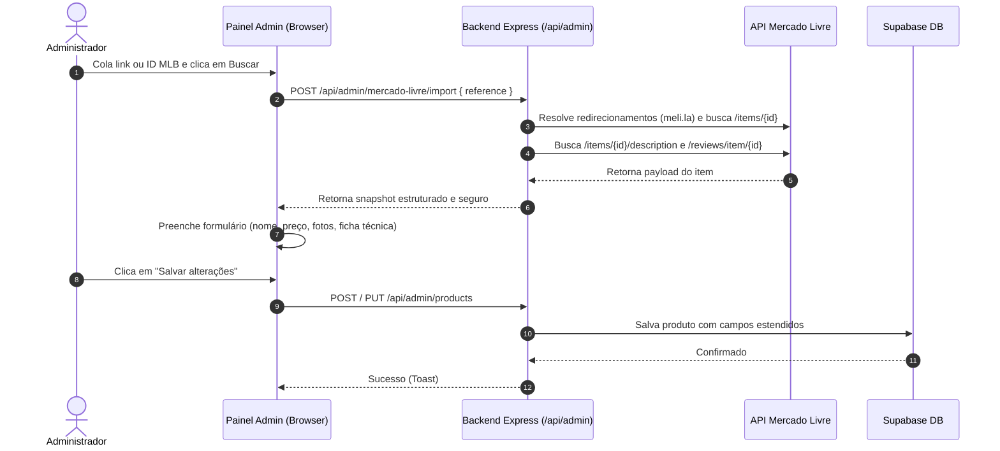

# Contexto do Projeto e Alterações Realizadas: Integração com Mercado Livre

> **Arquivo de Contexto para Continuidade (IA / Desenvolvedor)**  
> **Data:** 20/09/2026  
> **Branch principal:** `main`  
> **Status:** Todas as alterações foram testadas e validadas (`npm run test` com 100% de aprovação).

---

## 1. Visão Geral do que foi Desenvolvido

O sistema da **Gela Fácil** foi expandido para suportar **importação e sincronização automática de produtos da API oficial do Mercado Livre**, mantendo o modelo de afiliação e vitrine, com máxima segurança dos tokens e compatibilidade progressiva de banco de dados.

### Principais Objetivos Alcançados:
1. **Importação Rápida no Admin**: O administrador cola um ID `MLB...`, link completo de anúncio ou link encurtado de afiliado (`meli.la`) e o sistema preenche automaticamente dados técnicos, título, fotos, preços, descrição e avaliações.
2. **Segurança e Proteção de Segredos**: O token `MERCADO_LIVRE_ACCESS_TOKEN` reside exclusivamente no `backend/.env`. O frontend jamais tem acesso ao token.
3. **Resolução Segura de Redirecionamentos**: O backend resolve URLs curtas (`meli.la`) e valida hostnames permitidos para evitar SSRF e redirecionamentos maliciosos.
4. **Resiliência e Tolerância a Falhas**: Caso o anúncio não possua avaliações ou descrição, a importação continua com avisos amigáveis em vez de quebrar a requisição.
5. **Compatibilidade com Supabase (Zero Downtime)**: O repositório de dados (`backend/src/db.js`) detecta se a nova migration foi aplicada. Se ainda não tiver sido, continua funcionando para os produtos existentes legados e orienta a execução da migration quando um item do Mercado Livre for salvo.
6. **Experiência na Vitrine e Detalhes**: Exibição da galeria de fotos, tabela de especificações montada a partir dos atributos oficiais, nota média em estrelas, contagem de opiniões e comentários reais de compradores, além de indicação de disponibilidade do anúncio.

---

## 2. Arquivos Criados e Modificados

### 2.1. Novos Arquivos
- **`backend/src/mercado-livre.js`**: Módulo central de integração com a API do Mercado Livre.
  - Normalização de ID (`normalizeItemId`).
  - Resolução de URLs curtas e links de afiliados com limite de redirecionamentos e whitelist de domínios (`resolveItemReference`, `resolveShortUrl`).
  - Consulta aos endpoints oficiais `/items/{id}`, `/items/{id}/description` e `/reviews/item/{id}`.
  - Inferência inteligente de categorias (`split`, `inverter`, `portatil`, `bebidas`) com base no título e atributos.
  - Extração de especificações técnicas formatadas (`attributesToSpecs`) e galeria de imagens em alta resolução.
- **`supabase/migrations/202609200003_mercado_livre_catalog.sql`**: Migration SQL para o Supabase.
  - Adiciona colunas: `mercado_livre_id`, `description`, `gallery` (jsonb), `source_attributes` (jsonb), `rating`, `rating_count`, `reviews` (jsonb), `source_status`, `source_synced_at`.
  - Adiciona constraints de validação (regex MLB, ranges de rating, validação de tipos JSON) e índice único para `mercado_livre_id`.
- **`tests/mercado-livre.cjs`**: Testes automatizados cobrindo resolução de links curtos, mocks da API do Mercado Livre, proteção do token e tratamento de erros.

### 2.2. Arquivos do Backend Modificados
- **`backend/server.js`**:
  - `POST /api/admin/mercado-livre/import`: Endpoint protegido para buscar dados do anúncio a partir de um ID ou URL informada.
  - `POST /api/admin/products/:id/sync-mercado-livre`: Endpoint para re-sincronizar um produto já cadastrado com o anúncio de origem.
  - Validações atualizadas no `normalizeProductPayload` e `validateProduct` para suportar campos estendidos (limite de 10.000 caracteres na descrição, galeria de até 12 fotos, etc.).
  - Tratamento de erro customizado para instâncias de `MercadoLivreError`.
- **`backend/src/db.js`**:
  - Atualização do mapeamento do Supabase (`toDbProduct`, `fromDbProduct`, `fromPublicDbProduct`).
  - Tratamento retrocompatível para ausência de colunas (`isMissingCatalogColumn`, `toLegacyDbProduct`).
  - Métodos `getAdmin(id)` e `updateMercadoLivreData(id, snapshot)`.
- **`backend/package.json`**:
  - Scripts `check` e `test` integrados para executar todas as suítes de validação (`node tests/mercado-livre.cjs`, `tests/site-integrity.cjs`, etc.).

### 2.3. Arquivos do Frontend (Admin e Vitrine) Modificados
- **`admin/index.html`**:
  - Nova seção no modal de produto: "Importar do Mercado Livre" com campo para link/ID, botão de busca e área de status em tempo real.
- **`admin/admin.js`**:
  - Integração do botão de busca com a rota `/api/admin/mercado-livre/import`.
  - Preenchimento reativo de todos os campos do modal com os dados do anúncio.
  - Função `syncMercadoLivreProduct(id)` para sincronização manual a partir da listagem.
- **`admin/refresh.css`**:
  - Estilização temática em amarelo Mercado Livre para a área de importação.
- **`js/product-detail.js` e `pages/product-detail.html`**:
  - Aba de avaliações do Mercado Livre (`#tab-reviews`) com média de nota, total e cards de avaliações reais.
  - Tratamento de disponibilidade do anúncio (desativa o botão de compra se o anúncio estiver pausado ou inativo no ML).
  - Suporte à galeria completa de imagens e tabela estruturada de atributos.
- **`js/products-catalog.js` e `js/script.js`**:
  - Cards de produto passam a exibir badges dinâmicos de disponibilidade ("Disponível no Mercado Livre" ou "Anúncio indisponível").

### 2.4. Documentação e Schemas Modificados
- **`supabase/schema.sql`**: Atualizado para refletir o schema consolidado com todas as novas colunas e constraints.
- **`supabase/README.md`**: Guia atualizado com a ordem de execução das migrations.
- **`README.md`**: Instruções sobre a variável `MERCADO_LIVRE_ACCESS_TOKEN` e fluxo de importação pelo painel.

---

## 3. Endpoints e Fluxo de Dados



---

## 4. Configuração de Variáveis de Ambiente

No arquivo `backend/.env`, certifique-se de configurar:

```env
# Banco de Dados e Storage
SUPABASE_URL=https://<seu-projeto>.supabase.co
SUPABASE_SERVICE_ROLE_KEY=<sua-service-role-key>
SUPABASE_PRODUCT_IMAGES_BUCKET=products

# Sessão do Admin
SESSION_SECRET=<chave-secreta-com-pelo-menos-32-caracteres>

# Token de Integração do Mercado Livre (Somente Backend)
MERCADO_LIVRE_ACCESS_TOKEN=<seu_access_token_aqui>
```

> **Aviso de Segurança:** Nunca envie ou exponha `MERCADO_LIVRE_ACCESS_TOKEN` em scripts do frontend ou repositórios públicos.

---

## 5. Como Executar e Validar os Testes

Para validar a integridade de todo o projeto:

```bash
cd backend
npm run test
```

Este comando executa:
1. `npm run check`: Verificação de sintaxe de todos os arquivos JavaScript (backend e frontend).
2. `node tests/admin-state.cjs`: Validação de filtros, resumo, escapes e segurança do admin.
3. `node tests/maintenance-banner.cjs`: Validação de banner e persistência.
4. `node tests/site-integrity.cjs`: Validação de SEO técnico e referências a assets WebP.
5. `node tests/mercado-livre.cjs`: Validação da suíte da API do Mercado Livre.

---

## 6. Próximos Passos Sugeridos para Amanhã

Caso você ou outra IA continue a evolução deste módulo, estes são pontos naturais de melhoria:
1. **Webhook de Notificações do Mercado Livre**: Criar endpoint receptor de webhooks (`/api/webhooks/mercado-livre`) para atualizar preços e disponibilidade de anúncios automaticamente em segundo plano.
2. **Job de Sincronização Periódica**: Implementar cron/worker para re-checar produtos ativos periodicamente caso ocorram alterações de preço ou pausa de anúncios no Mercado Livre.
3. **Renovação Automática de Token OAuth (Refresh Token)**: Caso use uma aplicação OAuth completa do Mercado Livre com expiração a cada 6 horas, criar rotina para atualizar o access token usando o refresh token.
4. **Execução da Migration em Produção**: Garantir que `supabase/migrations/202609200003_mercado_livre_catalog.sql` seja executado no console SQL do Supabase caso o banco de produção seja novo.
